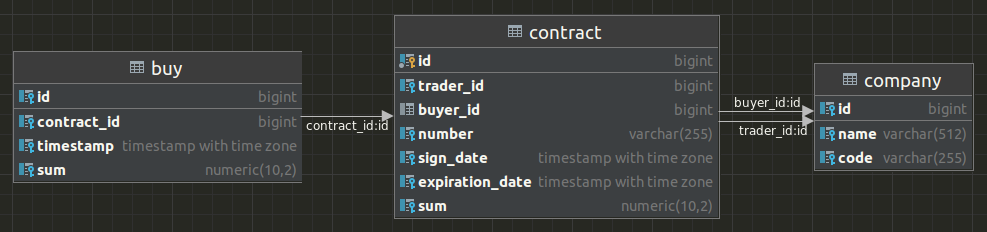

## Тестовое задание для разработчика golang

Задача на реализацию микросервиса с REST API для отслеживания информации о компаниях, контрактах между ними и покупках

### Используемые технологии

1. Golang как язык разработки
2. PostgreSQL как БД

### Модель данных и логика

Каждый контракт должен иметь положительную сумму. 
Любая покупка затронет сумму контракта, сумма покупок не дожна превышать его сумму.

#### Компания
1. Имя компании
2. Код компании (alphanumeric, опционально)

#### Контракт
1. Компания продавец
2. Компания покупатель
3. Номер контракта (alphanumeric)
4. Дата подписания
5. Дата действия
6. Сумма контракта

#### Покупки
1. Затронутый контракт
2. Дата и время покупки
3. Потраченные средства



### Как запускать

```
docker-compose up
```

